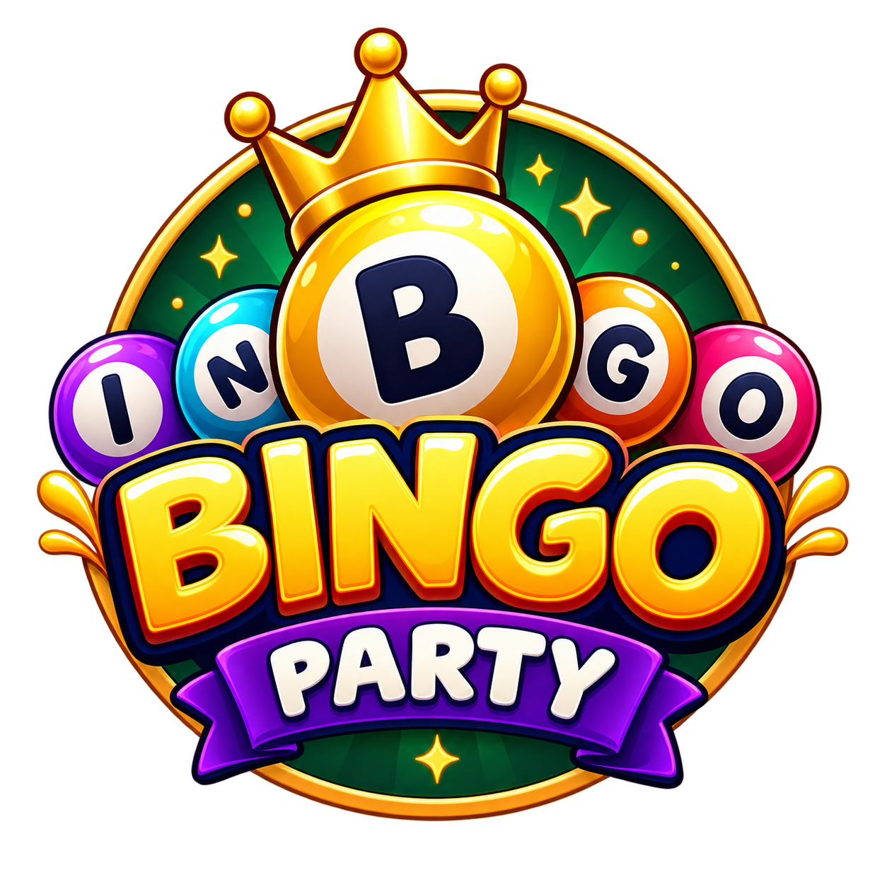

  
  
  # 🎱 Bingo Party — Premium Edition
  
  **¡La experiencia definitiva de Bingo multijugador online!**
  
  
  
  

  *Crea una sala, invita hasta a 6 amigos escaneando un código QR, y disfruta de una noche de casino sin salir de casa.*

---

## ✨ Características Principales

<table>
  <tr>
    <td width="50%">
      <h3>🎰 Tema de Casino Premium</h3>
      
Interfaz renovada con efectos <i>glassmorphism</i>, paleta de colores lujosa (dorados, esmeraldas y rubíes), y tipografía elegante.

    </td>
    <td width="50%">
      <h3>📱 Multidispositivo</h3>
      
Totalmente responsivo. Juega desde tu Smart TV (como Host) mientras tus amigos marcan sus cartones desde sus teléfonos.

    </td>
  </tr>
  <tr>
    <td width="50%">
      <h3>⚡ Sincronización en Tiempo Real</h3>
      
Cero retrasos. Las bolas cantadas, los marcados de cartón y el estado del juego se sincronizan instantáneamente mediante Firebase.

    </td>
    <td width="50%">
      <h3>🎯 Verificación Automática</h3>
      
El sistema verifica automáticamente los patrones al cantar BINGO. Si el jugador se equivoca o marca un número incorrecto, es penalizado.

    </td>
  </tr>
</table>

---

## 📖 Reglas del Juego

El juego se basa en el **Bingo clásico americano de 75 bolas**. ¡Presta mucha atención a tu cartón!

### 1️⃣ Tu Cartón de Bingo
- Cada jugador recibe un cartón de **5x5** con un estilo visual impresionante.
- La casilla central es un **⭐ Espacio Libre** y ya viene marcada.
- Los números están ordenados por columnas:
  - 🟣 **B:** 1 al 15
  - 🔵 **I:** 16 al 30
  - 🟡 **N:** 31 al 45
  - 🟢 **G:** 46 al 60
  - 🔴 **O:** 61 al 75

### 2️⃣ El Sorteo (Host)
- El Host de la sala hará girar la ruleta, la cual proyectará las animaciones con la bola actual (ej: **G 54**).
- El sorteo puede ser **Manual** o **Automático** (cada ciertos segundos).

### 3️⃣ Marcado Manual (Jugador)
- Cuando el Host canta un número, **toca la casilla en tu cartón** para marcarla. Verás aparecer un sello **✓**.
- Usa el panel de **Números Llamados** a tu derecha para revisar el historial completo de bolas que ya han salido.

### 4️⃣ Patrones de Victoria
Antes de iniciar, el Host configura cuál es la figura necesaria para ganar:

> 🟩 **Línea:** 5 casillas seguidas (Horizontal o Vertical).  
> 🟩 **Diagonal:** Línea cruzada de extremo a extremo.  
> 🟩 **Cuatro Esquinas:** Solo las 4 esquinas del cartón.  
> 🟩 **X:** Ambas diagonales formando una X.  
> 🟩 **Cartón Lleno (Blackout):** Marcar las 25 casillas completas.  

### 5️⃣ ¡Cantar BINGO!
Cuando completes el patrón activo, presiona el botón dorado gigante **¡BINGO!**.

> ⚠️ **¡CUIDADO CON LAS FALSAS ALARMAS!** ⚠️  
> Si cantas Bingo pero tu patrón está incompleto o marcaste un número que no ha salido, serás **eliminado** de la partida. ¡Revisa bien antes de gritar!
